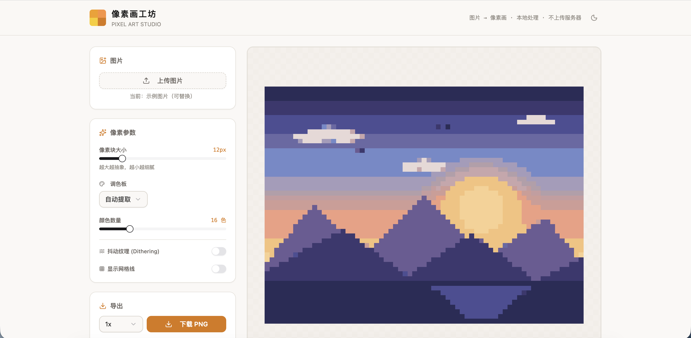

<p align="right"><a href="README-en.md">English</a></p>

<h1 align="center">🎨 像素画工坊</h1>

<p align="center">
  <strong><a href="https://ejuerz.com/pixelweb/">🔗 ejuerz.com/pixelweb</a></strong>
</p>

<p align="center">
  
  &nbsp;
  
</p>

---

## ✨ 功能

- 🖼️ 上传任意图片，一键转像素画
- 🎨 7 种调色板：自动提取 / Game Boy / NES / 灰阶 / 复古棕褐 / 蒸汽波 / **拼豆 Perler**
- 🧩 **拼豆模式** — 使用官方 Perler 色卡真实 RGB 值，可打印拼豆图纸
- 🎚️ 像素块 2px–64px 随意调节
- 🌊 Floyd–Steinberg 抖动纹理
- 📐 网格线开关，拼豆图纸必备
- 🌗 深色 / 浅色一键切换，自动记忆
- 🔒 纯本地处理，图片不上传任何服务器
- 📦 支持 1x / 2x / 4x 高清导出 PNG

---

## 📸 预览

| 浅色 | 深色 |
|------|------|
|  |  |

---

## 🧵 拼豆模式

选 **拼豆 Perler** 调色板 + 开网格线 → 下载 PNG → 直接照着拼。每个像素块对应一颗珠子，颜色匹配 Perler 实体色卡。

> 颜色数据来自 [Perler 官方色卡](https://oneimage.co/blogs/bead-brands-color-guide/)

---

## 🛠️ 技术栈

React 19 + TypeScript · Vite 7 · Tailwind CSS 3 + shadcn/ui · lucide-react · Floyd–Steinberg 抖动 + 中位切分量化

---

## 🚀 本地开发

```bash
git clone https://github.com/hooooolea/pixelweb.git
cd pixelweb
npm install
npm run dev    # → http://localhost:3000
npm run build  # → dist/
```

---

## 📄 协议

MIT

---

<p align="center">Made by <a href="https://ejuerz.com">ejuer</a> · <a href="mailto:ejuer_z@163.com">ejuer_z@163.com</a></p>
